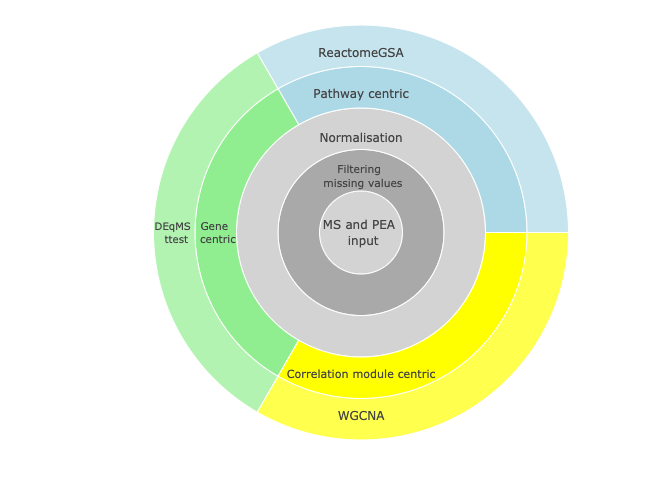

```{r setup, include=F}
require(knitr)

path_to_my_project="/Users/xrydbh/Personal/Projects/git_cloned/Neored_fresh/Neored"
knitr::opts_knit$set(root.dir = path_to_my_project)
#knitr::opts_knit$set(root.dir = "/Users/xrydbh/OneDrive - University of Gothenburg/Neored")

```
Supporting repository for the manuscript “The proteome signature of cord blood plasma with high hematopoietic stem and progenitor cell count”

## What this workflow does 


<!-- ```{r sunburst, echo=F, message=FALSE, fig.cap ="Three main types of analyses"} -->
<!-- source("./r_subscripts/make_graphcal_abstract/sunburst_plot.R") -->
<!-- fig -->
<!-- ``` -->

<!--  -->



This repository contains a set of R scripts that performs protein, pathway and correlation module centric analysis of proteomics data. 

More specifically it uses data from two different technologies that to a large extent complement each other in terms of covered proteins but also to a small extent overlaps in terms of that coverage. It takes two Excel files as input. One with Olink NPX protein expression values and one with mass spectrometry normalized abundance (formated output from Proteome Discoverer).

The specific data analyzed in this project is collected from cord blood plasma. 8 samples with high CDC34 concentration and 8 samples with low such concentration. The project is trying to find proteomics biomarkers for CD34 concentration. It looks for biomarkers on the single protein level but also looks more widely into pathways with differing expression patterns.

It looks for differentially expressed genes using the packages  t-test and DEqMS, pathways using ReactomeGSA and correlation modules using WGCNA.

## The purpose of this repository
The main purpose of this repository is to make the published analysis reproducible. A secondary usage would be for anyone to run the code for another project with similar datasets. Hope fully the repository will also develop beyond its state at publication.
It applies a set for recently published algorithms and software proven to outperform their predecessors in a workflow to identify biomarkers.

## How to run the analysis (the r-scripts)

There is a README.Rmd. It can be used to run all or a subset of the R scripts of the analysis. It also generates the README.md file for github site.


To reproduce the published analysis:

1. clone this repository 
2. Checkout commit 7bea4b7941ea96354e897b971d84758104e83545 from the master branch
3. Move or delete the out_r folder and make a new empty out_r
4. Edit "path_to_my_project" in README.Rmd 
5. Rerun the scripts in the "r_subscripts" folder. This is easiest done by running the README.Rmd file. It runs the R scripts and render markdown files and generates a README.md file with links to the markdown reports markdown files. (This was the only way I could render markdown form the scripts and keep the main direcory as working directory. I am sure there is a tidyer way to make README fils)
Note:  There is also a README_local_html.Rmd that can be used to generate a corresponding README file in html that can be used locally, not at github.)
6. For each subscript to be run from the README file(s) it might have to be "uncommented" by removing the hash in front of it.


```{r README_render_markdown_chunk1, include=F}
## Uncomment scripts sourced in this chunk that should be run (mark the lines and shift+cmd+C)
###############################################
# only need to be run first time !!!
# rmarkdown::render("./r_subscripts/0_install_packages.R","github_document", output_dir="./markdown/")
##############################################
# rmarkdown::render("./r_subscripts/000a_ms_project_specific_formatting.R","github_document", output_dir="./markdown/")
# rmarkdown::render("./r_subscripts/000b_pea_project_specific_formatting.R","github_document", output_dir="./markdown/")
# rmarkdown::render("./r_subscripts/000_make_directories.R","github_document", output_dir="./markdown/")
# rmarkdown::render("./r_subscripts/002a1_filter_ms_go_bp_keratinization.R","github_document", output_dir="./markdown/")
# rmarkdown::render("./r_subscripts/002a2_ms_format_normalize_naFilter.R","github_document", output_dir="./markdown/")
# rmarkdown::render("./r_subscripts/002b_pea_format_normalize_naFilter.R","github_document", output_dir="./markdown/")
# rmarkdown::render("./r_subscripts/003_collect_ms_and_pea.R","github_document", output_dir="./markdown/")
# rmarkdown::render("./r_subscripts/004_correlation_platform_shared.R","github_document", output_dir="./markdown/")
# rmarkdown::render("./r_subscripts/005_gsea_camera_ReactomeGSA.R","github_document", output_dir="./markdown/")

```

```{r README_chunk2, include=F}
# Generating a report with web links to ReactomeGSA analysis results
getwd()
setwd(path_to_my_project)
my_methods <- c("Camera") # "ssGSEA","PADOG",
reactome_res <- list()
for (meth in my_methods){
res <- list()
res[["ms"]] <- readRDS(paste("./RData/reactome_results/ReactomeGSA_result_",meth,"_ms_abundances_eq_med_norm.rds",sep=""))
res[["pea"]] <- readRDS(paste("./RData/reactome_results/ReactomeGSA_result_",meth,"_pea_abundances_eq_med_norm.rds",sep="")) 
reactome_res[[meth]] <- res
}
```

```{r README_render_markdown_chunk3, include=F}
# For script 012_collect_filt_norm_data_and_testresults.R any interesting WGCNA module has to be copied and put 
#in folder ./out_r/WGCNA/ and the actual file name has to match the one used in the script.
# IN this case file name "pea_black_module_genes_with_go.xlsx" is used

# Uncomment scripts sourced in this chunk that should be run (mark the lines and shift+cmd+C)
# csv files read by script 006 has to be downloaded in "./out_r/Reactome" from Reactome as "ms_camera.csv" and "pea_camera.csv"
# Urls to Reacotme results: reactome_res[["Camera"]][["ms"]]@reactome_links[[1]][["url"]] and # reactome_res[["Camera"]][["pea"]]@reactome_links[[1]][["url"]]`
# press "downloads" and then "pathway analysis results" 
# should have following format

# rmarkdown::render("./r_subscripts/006a_collect_reactome_results_tables.R","github_document", output_dir="./markdown/")
# rmarkdown::render("./r_subscripts/006b_reactome_dotplot.R","github_document", output_dir="./markdown/")
# rmarkdown::render("./r_subscripts/006c_reactome_results_in_hierarch_tree.R","github_document", output_dir="./markdown/")
# rmarkdown::render("./r_subscripts/007_statistical_testing_and_relevant_plots.R","github_document", output_dir="./markdown/")
# rmarkdown::render("./r_subscripts/008_boxplots.R","github_document", output_dir="./markdown/")
# rmarkdown::render("./r_subscripts/009_WGCNA.R","github_document", output_dir="./markdown/")
# rmarkdown::render("./r_subscripts/009b_WGCNA_uniprot.R","github_document", output_dir="./markdown/")
# rmarkdown::render("./r_subscripts/010_plot_WGCNA_hubgene_network.R","github_document", output_dir="./markdown/")
# rmarkdown::render("./r_subscripts/011_WGCNA_ORA_Kegg.R","github_document", output_dir="./markdown/")
# rmarkdown::render("./r_subscripts/012_collect_filt_norm_data_and_testresults.R","github_document", output_dir="./markdown/")
# rmarkdown::render("./r_subscripts/013_add_annotation.R","github_document", output_dir="./markdown/")
# rmarkdown::render("./r_subscripts/014_doublecheck_foldchange.R","github_document", output_dir="./markdown/")
# rmarkdown::render("./r_subscripts/015a_plot_concentrations_ms.R","github_document", output_dir="./markdown/")
# rmarkdown::render("./r_subscripts/015b_plot_concentrations_pea.R","github_document", output_dir="./markdown/")
# rmarkdown::render("./r_subscripts/016_annotate_relevant_wgcna_mods.R","github_document", output_dir="./markdown/")
rmarkdown::render("./r_subscripts/020_compile_supplementory_tables.R","github_document", output_dir="./markdown/")
rmarkdown::render("./r_subscripts/020_compile_supplementory_tables.R","github_document", output_dir="./markdown/")
# rmarkdown::render("./r_subscripts/022_render_compile_supplementory_figures.R","github_document", output_dir="./markdown/")

```

## Take a look the code

If you would like to see what is going on in the scripts the code and output can be accessed with the linkes below. The links are in order of executions.

* [install packages](markdown/0_install_packages.md)
* [ms_project_specific_formatting](markdown/000a_ms_project_specific_formatting.md)
* [pea_project_specific_formatting](markdown/000b_pea_project_specific_formatting.md)
* [make_per_plf_sample_name_keys](markdown/001_make_per_plf_sample_name_keys.md)
* [filter_ms_go_bp_keratinization.](markdown/002a1_filter_ms_go_bp_keratinization.md)
* [ms_format_normalize_naFilter](markdown/002a2_ms_format_normalize_naFilter.md)
* [pea_format_normalize_naFilter](markdown/002b_pea_format_normalize_naFilter.md)
* [collect_ms_and_pea](markdown/003_collect_ms_and_pea.md)
* [correlation_platform_shared](markdown/004_correlation_platform_shared.md)
* [gsea_padog_ReactomeGSA](markdown/005_gsea_padog_ReactomeGSA.md)
* [collect_reactome_results_tables](markdown/006a_collect_reactome_results_tables.md)
* [visualize_reactome_results_in_dot_plot](markdown/006b_reactome_dotplot.md)
* [statistical_testing_and_relevant_plots](markdown/007_statistical_testing_and_relevant_plots.md)
* [boxplots](markdown/008_boxplots.md)
* [WGCNA using gene symbol gene ID](markdown/009_WGCNA.md)
* [WGCNA using uniprot gene ID](markdown/009b_WGCNA_uniprot.md)
* [plot_WGCNA_hubgene_network](markdown/010_plot_WGCNA_hubgene_network.md)
* [WGCNA_ORA_Kegg](markdown/011_WGCNA_ORA_Kegg.md)
* [collect_filt_norm_data_and_testresults](markdown/012_collect_filt_norm_data_and_testresults.md)
* [add_annotation](markdown/013_add_annotation.md)
* [plot_concentrations_ms](markdown/015a_plot_concentrations_ms.md)
* [plot_concentrations_pea](markdown/015b_plot_concentrations_pea.md)
* [annotate_relevant_wgcna_mods](markdown/016_annotate_relevant_wgcna_mods.md)
* [compile_supplementory_file](markdown/020_compile_supplementory_tables.md)

<!-- When you want to create local html report uncommen this and comment the markdown references above -->
<!-- * [install packages](rendered_html/0_install_packages.html) -->
<!-- * [ms_project_specific_formatting](rendered_html/000a_ms_project_specific_formatting.html) -->
<!-- * [pea_project_specific_formatting](rendered_html/000b_pea_project_specific_formatting.html) -->
<!-- * [make_per_plf_sample_name_keys](rendered_html/001_make_per_plf_sample_name_keys.html) -->
<!-- * [ms_format_normalize_naFilter](rendered_html/002a_ms_format_normalize_naFilter.html) -->
<!-- * [pea_format_normalize_naFilter](rendered_html/002b_pea_format_normalize_naFilter.html) -->
<!-- * [collect_ms_and_pea](rendered_html/003_collect_ms_and_pea.html) -->
<!-- * [correlation_platform_shared](rendered_html/004_correlation_platform_shared.html) -->
<!-- * [gsea_padog_ReactomeGSA](rendered_html/005_gsea_padog_ReactomeGSA.html) -->
<!-- * [collect_reactome_results_tables](rendered_html/006_collect_reactome_results_tables.html) -->
<!-- * [statistical_testing_and_relevant_plots](rendered_html/007_statistical_testing_and_relevant_plots.html) -->
<!-- * [boxplots](rendered_html/008_boxplots.html) -->
<!-- * [WGCNA](rendered_html/009_WGCNA.html) -->
<!-- * [plot_WGCNA_hubgene_network](rendered_html/010_plot_WGCNA_hubgene_network.html) -->
<!-- * [WGCNA_ORA_Kegg](rendered_html/011_WGCNA_ORA_Kegg.html) -->
<!-- * [collect_filt_norm_data_and_testresults](rendered_html/012_collect_filt_norm_data_and_testresults.html) -->
<!-- * [add_annotation](rendered_html/013_add_annotation.html) -->
<!-- * [plot_concentrations_ms](rendered_html/015a_plot_concentrations_ms.html) -->
<!-- * [plot_concentrations_pea](rendered_html/015b_plot_concentrations_pea.html) -->
<!-- * [annotate_relevant_wgcna_mods](rendered_html/016_annotate_relevant_wgcna_mods.html) -->
<!-- * [compile_supplementory_file](rendered_html/020_compile_supplementory_tables.html) -->


```{r render_html, include=F}
# source("./render_html.R")
```


## Links to Reactome webserver to browse results
Only active at Reactome server for seven days. Then this analysis (or script 006) has to be rerun.

### Correlation Adjusted MEan RAnk (CAMERA)


* [MS](`r reactome_res[["Camera"]][["ms"]]@reactome_links[[1]][["url"]]`)
* [PEA](`r reactome_res[["Camera"]][["pea"]]@reactome_links[[1]][["url"]]`)

## Generating the README.md file for Github (the file that you are reading now)
Run/Knit "README.Rmd"

## Generating the README.html for local browsing
Run "render_html.R"

## References to all used R packages
